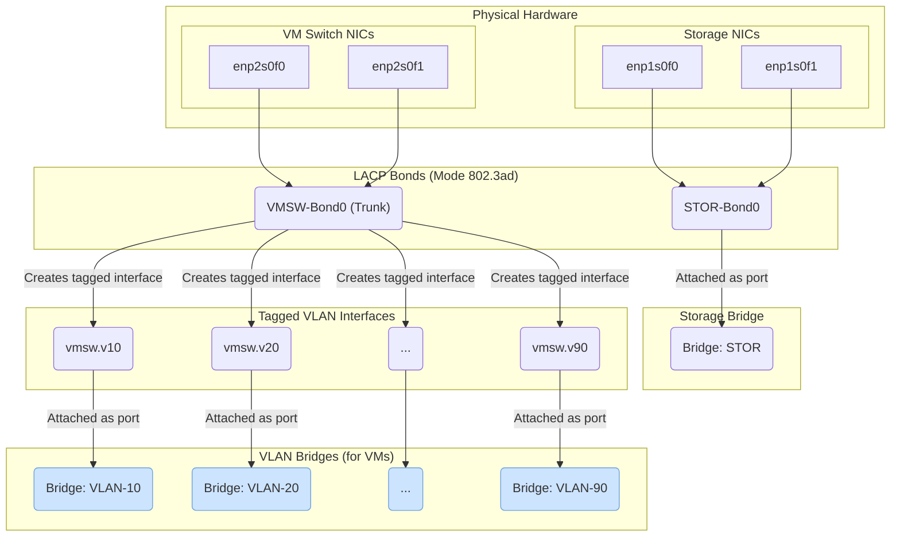

# KVM Hypervisor Configuration for CentOS 10

This project contains a set of Ansible playbooks and shell scripts designed to fully configure a KVM hypervisor on a fresh CentOS 10 installation. The scripts automate the setup of virtualization, networking, and storage.

## Network Diagram



## Getting Started

To begin the configuration, execute the main build script as root:
```bash
sudo ./build.sh
```

## File Descriptions

- **`build.sh`**: The main entry point for the configuration. This script installs Ansible and its required collections, then executes the core Ansible playbooks (`add_virtualization.yml`, `add_network.yml`, `add_storage.yml`) in the correct order.

- **`add_virtualization.yml`**: An Ansible playbook that installs the KVM virtualization packages, Cockpit for web-based management, and other virtualization tools. It also ensures the `libvirtd` service is running.

- **`add_network.yml`**: An Ansible playbook responsible for configuring the host's networking. It creates network bridges and LACP bonds for virtual machine traffic and storage. It dynamically creates VLAN-based bridges based on the definitions in `vlans.csv`.

- **`vlans.csv`**: A data file containing a list of VLAN IDs and names that are used by `add_network.yml` to create the corresponding network bridges.

- **`add_storage.yml`**: An Ansible playbook that sets up a shared NFS storage pool for `libvirt`. This allows virtual machine disks to be stored on a network-attached storage device.

- **`add_vmtmplt.yml`**: An optional Ansible playbook (not run by `build.sh`) to create a Debian 13 VM template. It automates the creation of a base OS image that can be quickly cloned to new VMs.

- **`preseed.cfg`**: A Debian preseed configuration file used by `add_vmtmplt.yml` to automate the operating system installation for the VM template.
